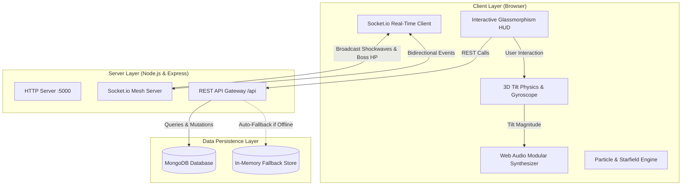

# ⚡ XP & Streak Card System (Quantum Core v2.0)

An advanced, full-stack interactive gamification platform featuring **custom Web Audio modular synthesis**, **real-time Socket.io multiplayer synchronization**, **3D cursor velocity particle physics**, **60-day activity heatmap telemetry**, **procedural daily quests**, **co-op raid boss battles**, and **cosmetic frame customization**.

---

## 🏗️ System Architecture



---

## 🌟 Architectural & Implementation Highlights

### 1. 3D Tilt Physics & Specular Glare Computation
When hovering or dragging over the main streak card, a mouse coordinate listener computes relative offsets centered around the card's midpoint:

$$\text{dx} = \frac{x_{\text{cursor}} - \frac{\text{width}}{2}}{\frac{\text{width}}{2}}, \quad \text{dy} = \frac{y_{\text{cursor}} - \frac{\text{height}}{2}}{\frac{\text{height}}{2}}$$

* **Bounded Domain:** Both $\text{dx}, \text{dy} \in [-1.0, 1.0]$.
* **Angular Deflection:**
  $$\text{rotX} = -(\text{dy} \times 12^\circ), \quad \text{rotY} = (\text{dx} \times 12^\circ)$$
* **Specular Glare:** The glare overlay uses CSS custom properties `--glare-x` and `--glare-y` to position radial gradients directly under the user's cursor.
* **Mobile Gyroscope Integration:** Uses HTML5 `DeviceOrientationEvent` (`gamma` and `beta` angles) to drive the same 3D matrix transformations dynamically when tilted on a smartphone.

### 2. Web Audio Modular Synthesis & Live Oscilloscope
The audio architecture bypasses pre-recorded audio files in favor of **pure Web Audio API synthesis**:
* **Dual Oscillators:**
  * Node 1 (Space Hum): Sweeps from $55\text{ Hz}$ (A1 note) up to $80\text{ Hz}$ based on tilt velocity.
  * Node 2 (Resonance Harmonics): Sweeps from $110\text{ Hz}$ (A2 note) up to $160\text{ Hz}$.
* **Lowpass Biquad Filter:**
  * Sweeps cutoff frequency dynamically from $180\text{ Hz}$ (flat) to $550\text{ Hz}+$ (bright) with adjustable $Q$ resonance ($0.5 - 15.0$).
* **Synthesizer Control Rack:** An interactive studio modal featuring live waveform selection (**Sine**, **Triangle**, **Sawtooth**, **Square**), filter sliders, drone volume, and real-time canvas oscilloscope powered by `AnalyserNode.getByteTimeDomainData()`.

### 3. Real-Time Bidirectional Multiplayer (Socket.io)
* **Tether Shockwaves:** When any player logs an activity, a high-voltage shockwave pulses across the cubic Bezier SVG tether connecting partner cards across active browser sessions.
* **Partner High-Five:** Real-time cheers trigger glowing pulses, celebratory chimes, and haptic vibrations on the partner's screen.
* **Joint Raid Boss Damage:** Attack strikes are broadcast instantaneously to synchronize the boss HP bar across all clients.

### 4. 60-Day Activity Heatmap Matrix
* Renders a 60-day historical activity matrix (Duolingo / GitHub style).
* Cells map to 5 distinct visual intensity levels based on daily XP accumulation:
  * Level 0 ($0\text{ XP}$): Muted baseline.
  * Level 1 ($1 - 99\text{ XP}$): Faint accent glow.
  * Level 2 ($100 - 199\text{ XP}$): Medium phosphor glow.
  * Level 3 ($200 - 299\text{ XP}$): High-intensity neon glow.
  * Level 4 ($300+\text{ XP}$): Quantum saturated flare with shadow bloom.
* Hover tooltips display exact timestamps, XP values, and session counts.

### 5. Procedural Daily Quests & Challenges
* Dynamically tracks daily directives (*Consistency Sprint*, *XP Overdrive*, *Raid Vanguard*).
* Real-time progress bars update with backend state.
* Completed quests unlock the **"CLAIM"** trigger, granting bonus XP and **Streak Crystals (💎)** with celebratory audio chords.

### 6. Co-Op Raid Boss Arena: "Chronos the Streak Devourer"
* A collaborative weekly world-boss with an interactive integrity gauge ($5,000\text{ HP}$).
* Striking deals direct damage, generates floating critical hit damage numbers (`-150 HP`), triggers plasma sound FX, and awards Crystals and XP.
* Defeating Chronos unlocks the exclusive **Holographic "Chronos Slayer" Badge**.

### 7. Cosmetic Vault & Animated Card Frames
Users can spend earned Streak Crystals (💎) in the shop to unlock and equip animated card frames:
* ⚡ **Electric Arc Frame:** Pulsing high-voltage neon cyan border discharge.
* 🔥 **Molten Magma Frame:** Hyperthermal flame gradient with ember glow.
* 💎 **Quantum Hologram Frame:** Chromatic rainbow spectral sheen flow.
* 👾 **Cyber Matrix Frame:** CRT scanline phosphor terminal border.
* **Player Titles:** *Void Walker*, *Chronos Slayer*, *Hyperdrive Pilot*.

### 8. 1-Click High-Res PNG Card Export
* Utilizes `html2canvas` to flatten 3D perspective momentarily, rasterize the customized card at $2.5\times$ retina resolution, and trigger an instant `.png` download.

### 9. Cubic Bezier Co-Op Tether Math
The mathematical path for the SVG tether links the center bottom of the main card $(x_1, y_1)$ to the center left of the partner card $(x_2, y_2)$ using cubic control points:

$$C(t) = (1-t)^3 P_1 + 3(1-t)^2 t C_1 + 3(1-t) t^2 C_2 + t^3 P_2$$

$$\text{with } C_1 = (x_1 + 0.1\Delta x, \, y_1 + 0.8\Delta y), \quad C_2 = (x_1 + 0.5\Delta x, \, y_2)$$

---

## 🛠️ Tech Stack

| Domain | Technologies |
| :--- | :--- |
| **Frontend UI** | HTML5, Vanilla CSS3 (Hardware-accelerated 3D Transforms, Glassmorphism, CSS Custom Properties) |
| **Frontend Logic** | Vanilla ES6+ JavaScript, Web Audio API, Canvas 2D Physics API, DeviceOrientation API, Haptics API |
| **Export Engine** | `html2canvas` (client-side DOM rasterization) |
| **Real-Time Mesh** | `socket.io-client` |
| **Backend Runtime** | Node.js, Express.js, `socket.io` |
| **Persistence** | MongoDB via Mongoose, with transparent in-memory database fallback |

---

## 📡 API Reference

### User & Dashboard
* `GET /api/users/:id/dashboard` - Retrieve user profile, partner stats, badges, and theme.
* `POST /api/users/:id/activity` - Log activity, compute streak buffs, update heatmap, and emit socket pulse.
* `POST /api/users/:id/spend-xp` - Spend 500 XP to revive a broken partner streak.
* `POST /api/users/:id/theme` - Persist active theme (`deep-space`, `cyberpunk`, `solar-flare`).
* `POST /api/users/:id/customize` - Update active animated frame and player title.

### Quests & Heatmap
* `GET /api/users/:id/heatmap` - Fetch 60-day historical XP and activity counts.
* `GET /api/users/:id/quests` - Fetch daily protocol objectives and progress.
* `POST /api/users/:id/quests/:questId/claim` - Claim reward XP and Crystals for completed quests.

### Boss Arena & Shop
* `GET /api/boss` - Fetch current raid boss health and tier metadata.
* `POST /api/boss/attack` - Deal damage to Chronos, earn crystals, and broadcast damage event.
* `GET /api/shop/items` - Fetch catalog of unlockable frames, titles, and shield refills.
* `POST /api/shop/purchase` - Purchase and equip items using earned crystals.

### Leaderboards & Seed
* `GET /api/leaderboard` - Fetch ranked player ladder across Cosmic, Diamond, and Gold tiers.
* `POST /api/seed` - Reset and re-seed database with upgraded defaults.

---

## 🚀 Getting Started Locally

### Prerequisites
* [Node.js](https://nodejs.org/) (v18 or higher recommended)
* [MongoDB](https://www.mongodb.com/) *(Optional: server runs automatically in in-memory fallback mode if MongoDB is not present)*

### Installation
```bash
# 1. Clone the repository
git clone https://github.com/amruthck177/xp_card.git
cd xp_card

# 2. Install dependencies
npm install

# 3. Start the application
npm start
```

Open your browser and navigate to:
```
http://localhost:5000
```

> **Pro-tip:** Open two browser tabs side-by-side to witness real-time WebSocket sync, high-fives, and joint boss attacks in action!

---

## 📂 Project Structure

```
xp_card/
├── backend/
│   ├── models/
│   │   └── User.js          # Mongoose schema (quests, heatmap history, frames, titles, crystals)
│   ├── routes/
│   │   └── api.js           # REST API routes (dashboard, activity, quests, boss, shop, leaderboard)
│   └── server.js            # Express server wrapped with HTTP & Socket.io engine
├── public/
│   ├── app.js               # Frontend controller, Web Audio synth, sockets, particles, quests, 3D tilt
│   ├── index.html           # Semantic markup, HUD top bar, 3D cards, heatmap, modals
│   └── styles.css           # Glassmorphism, animated frames, oscilloscope, responsive layouts
├── .gitignore               # Ignores node_modules, temp logs, environment variables
├── package.json             # Dependencies and scripts
└── README.md                # System documentation
```

---

## 📄 License
MIT License. Built for advanced web gamification, audio synthesis, and real-time interaction benchmarks.
